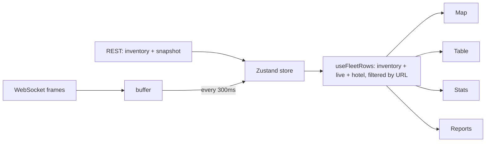

# Fleet dashboard

Next.js App Router, React, Tailwind, Zustand, MapLibre GL, TanStack Virtual, lucide-react. Source: `fleet-dashboard/`.

| Path | Responsibility |
| --- | --- |
| `app/(app)/layout.tsx` | Auth guard, the single fleet connection, navigation |
| `app/(app)/page.tsx` | Overview |
| `app/(app)/sites/[siteId]` | Hotel page |
| `app/(app)/robots` | Inventory, create, robot page with edit and delete |
| `app/(app)/reports` | Report index and the four reports |
| `lib/fleet-store.ts` | Zustand store: connection, live state, inventory, CRUD actions |
| `lib/fleet-view.ts` | URL filters, inventory joined with live state, status helpers |
| `components/FleetMap.tsx` | MapLibre map with clustering |

## State

* The layout opens one connection for the whole session, so navigating between pages never reconnects.
* Socket frames are buffered and committed at most every 300ms; updates older than the held state are ignored.
* A reconnect reloads inventory and snapshot, which resyncs anything missed and surfaces an expired token as a 401.
* Filters are URL search parameters, read through `useFilters`.

## Map

MapLibre GL renders with WebGL. Robots are one GeoJSON source with clustering; a cluster aggregates a count of faulted robots and turns amber when it is above zero. The camera refits only when the `fitKey` changes (a filter, a hotel, a robot), never on live updates. The base map is OpenFreeMap's free vector style; swap `STYLE_URL` for a commercial or self hosted style in production.
