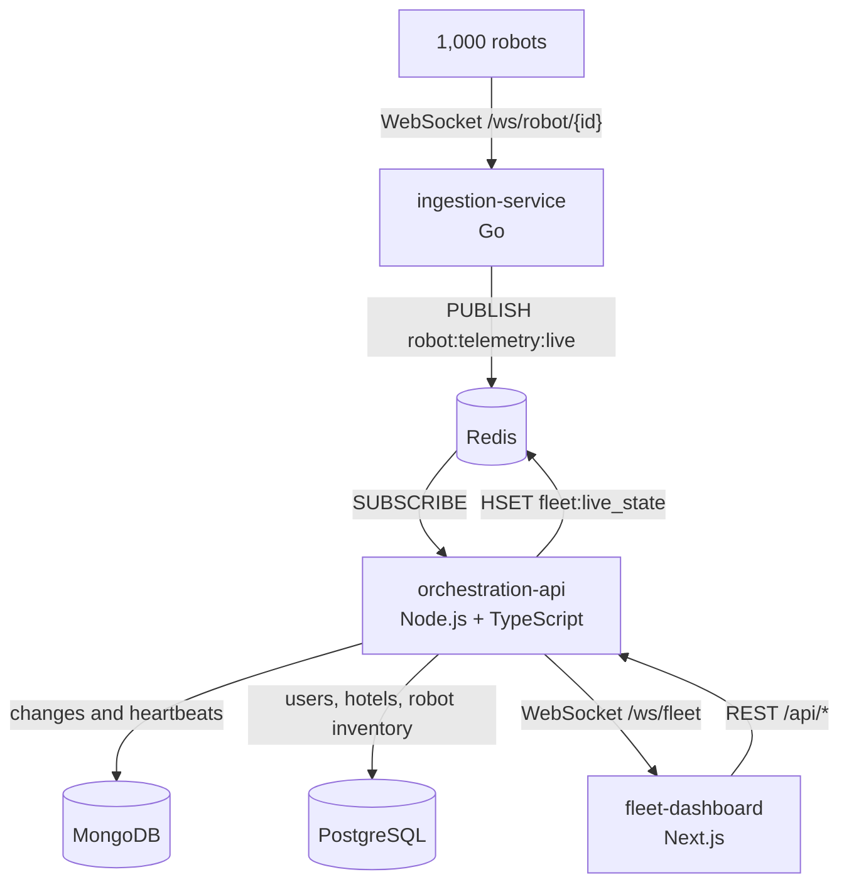

# Architecture overview

The platform is a monorepo with three decoupled services. They share no code and talk only through Redis and HTTP or WebSocket, so each can be built, scaled and replaced on its own.

| Directory | Responsibility | Port |
| --- | --- | --- |
| `ingestion-service/` | Accept robot sockets, validate and throttle packets, publish to Redis. Also holds the fleet simulator. | 8080 |
| `orchestration-api/` | Authentication, inventory and robot CRUD, live state cache, telemetry history, reports, dashboard fan out. | 4000 |
| `fleet-dashboard/` | Map, filters, reports, robot management. | 3000 |
| `docs/` | This site. | |

## Where each kind of data lives

| Data | Store | Why |
| --- | --- | --- |
| Users, companies, hotels, robot inventory | PostgreSQL | Relational, permanent, edited through CRUD |
| Latest state of every robot | Redis hash | Hot, rebuilt within a second, read on every dashboard load |
| Telemetry stream | Redis Pub/Sub | Decouples ingestion from the API |
| Telemetry history, error logs, Skill Store | MongoDB | High volume or schemaless, expires or grows independently |

## Design principles

* **Validate at the edge.** The ingestion service rejects bad packets before they cost anything downstream. The API validates again at its own boundary.
* **Batch everything on the hot path.** Redis writes, dashboard frames and MongoDB inserts all happen once per 250ms batch, independent of fleet size.
* **Inventory is the source of truth.** Live state and history are joined to the PostgreSQL inventory; a robot that is not in the inventory does not appear anywhere in the dashboard.
* **Every query is scoped to the caller's company.**
