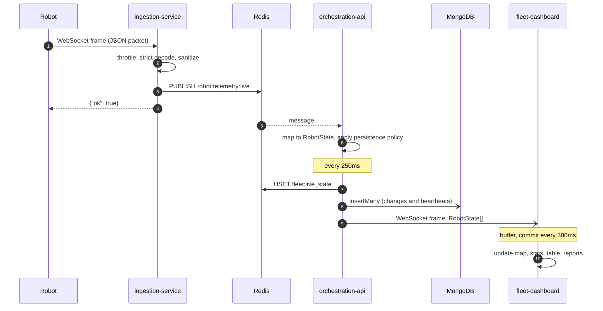
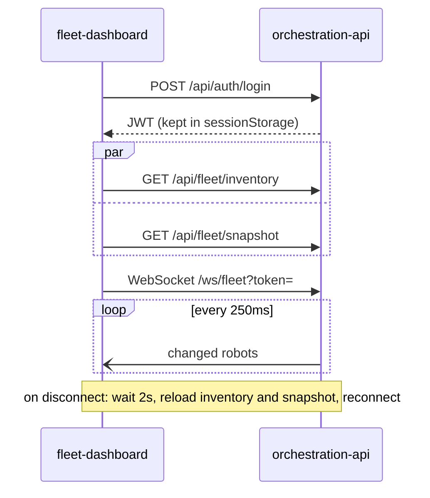

# Telemetry flow

A packet travels from robot to pixel in about half a second in the worst case: up to 250ms waiting for the API batch plus up to 300ms waiting for the dashboard flush.

## Dashboard start up

