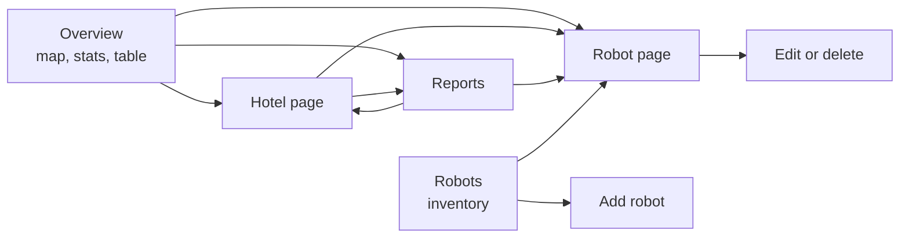

# Using the dashboard

Sign in at the dashboard URL. Locally that is http://localhost:3000 with the admin from `ADMIN_EMAIL` and `ADMIN_PASSWORD`.

## Navigation

Every view keeps its filters in the URL, so any screen can be bookmarked or shared.

## Overview

* **Filters**: region, country, hotel, robot type and status. Narrower location choices follow the wider ones, so picking Asia Pacific limits countries and hotels to that region.
* **Stats**: robots, availability, count per status and average battery for the filtered set.
* **Map**: robots cluster at world zoom. Click a cluster to zoom in, hover a robot to see its task, click it to open its page. The map refits whenever the filters change.
* **Table**: every matching robot, virtualized so 1,000 rows scroll smoothly. Robot and hotel names are links.
* **Report cards**: the four reports with a live headline figure, carrying the current filters.

## Hotel page

Local time, stats, a map of the hotel, a breakdown per robot type with availability, the hotel's robots and report cards scoped to that hotel.

## Robot page

Live battery, speed, task and last report time; the battery curve for the last hour with faults marked; the recent task list; the position on the map; and the inventory record.

## Reports

| Report | Source | Rows link to |
| --- | --- | --- |
| Availability by hotel | Live state | Hotel, and the hotel's incidents |
| Low battery | Live state | Robot and hotel |
| Open incidents | Live state | Robot and hotel |
| Tasks and elevator rides | MongoDB history, last 1, 6 or 24 hours | Hotel and hotel filtered by robot type |

## Managing robots

Admins and operators see **Add robot** on the Robots page and **Edit** and **Delete** on each robot page. Viewers see neither, and the API rejects their writes with 403.

* **Create**: id, type, hotel, model, serial number, firmware, maximum speed and battery capacity. A new robot shows as offline until a robot with the same id connects to the ingestion service.
* **Update**: every field except the id, including moving a robot to another hotel.
* **Delete**: removes the inventory record and its live state. Telemetry history stays until it expires after 7 days.
