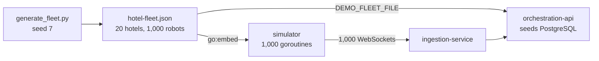
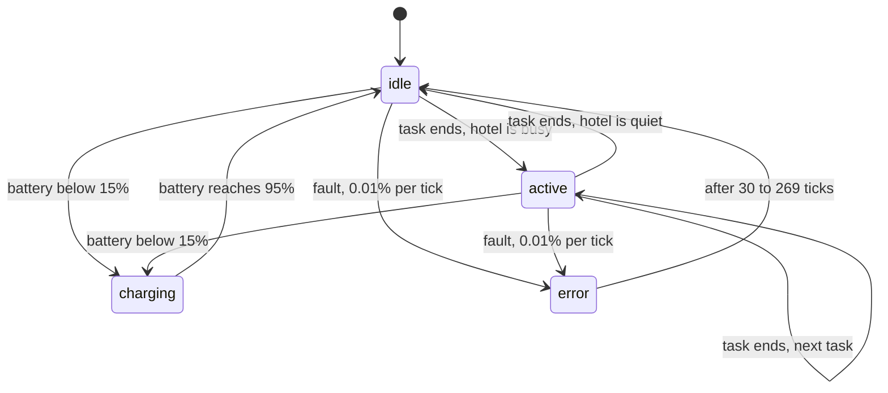

# How the simulation works

The platform is built for 1,000 concurrent robots, so developing and demonstrating it needs 1,000 robots that behave plausibly. This page explains how the simulated fleet was designed, which numbers drive it and why, and how to change it.

The simulation has two parts:

| Part | File | Runs |
| --- | --- | --- |
| The world: hotels and robots | `ingestion-service/cmd/simulator/generate_fleet.py` writes `hotel-fleet.json` | Once, when the world changes |
| The behaviour: what each robot does every second | `ingestion-service/cmd/simulator/main.go` | Continuously, as the `simulator` container |



One file feeds both the simulator and the database seed, so the robots that connect are always the robots in the inventory.

## Step 1: choosing a scenario

A random walk of anonymous dots exercises the pipeline but tells nothing about whether the dashboard is useful. The scenario follows the use cases that robot fleet orchestration providers publish for their customers: hotel chains running robots from several vendors, where robots share lobbies and corridors and depend on elevator integration to move between floors.

A global hotel group was chosen because it produces the questions the dashboard must answer:

* **Many sites far apart**, which needs a world map, location filters and per site views.
* **Several robot types** with different jobs and rhythms, which needs type filters and per type reports.
* **Local time matters**: a hotel in Tokyo is cleaning at night while one in New York serves breakfast.
* **Elevators are a known bottleneck**, which justifies a dedicated elevator ride metric.

## Step 2: generating the world

`generate_fleet.py` builds the static world with a fixed random seed, so it is reproducible: running it again without edits produces the committed JSON byte for byte.

### Hotels

20 hotels in real cities across five regions, placed at city centre coordinates with their IANA time zone:

| Region | Hotels |
| --- | --- |
| Europe | 7 |
| North America | 4 |
| Latin America | 2 |
| Middle East and Africa | 2 |
| Asia Pacific | 5 |

Each hotel gets a random weight between 0.6 and 1.6; the 1,000 robots are shared out in proportion, which gives hotels between 33 and 80 robots. Uneven sizes make the availability report and the map clusters more realistic than 20 identical hotels.

### Robot types

| Type | Share | Models (max speed, battery) | Reasoning |
| --- | --- | --- | --- |
| Cleaning | 36% | Scrubber S50 (1.0 m/s, 1200 Wh), Vacuum V40 (0.8 m/s, 800 Wh) | Largest fleet in hotels: lobbies, corridors, ballrooms |
| Delivery | 32% | Courier D2 (1.2 m/s, 900 Wh) | Room service and kitchen runs; the busiest elevator users |
| Room service | 16% | Minibar M1 (1.0 m/s, 700 Wh) | Minibar restocking floor by floor |
| Reception | 16% | Concierge C3 (0.8 m/s, 600 Wh) | Greeting and guiding in the lobby |

Model names are invented. Each robot also gets a serial number and one of four firmware versions, so the inventory looks like a fleet bought over several years.

### Identifiers

Robot ids read as `{hotel}-{type code}-{number}`, for example `tyo-rms-12` is room service robot 12 in Tokyo. Type codes are `cln`, `dlv`, `rms` and `rcp`. Readable ids make logs, URLs and the map popups understandable without a lookup.

## Step 3: robot behaviour

Every robot is an independent state machine advanced once per tick. A tick is the send interval, 1 second by default.



### Tasks and the hotel's rhythm

A task lasts 20 to 119 ticks. When it ends, the robot starts a new task with a probability that depends on its type and the hotel's local hour; otherwise it goes idle with the task `awaiting_dispatch`.

| Type | Day (07:00 to 23:00) | Night |
| --- | --- | --- |
| Cleaning | 45% | 85% |
| Delivery, Room service | 75% | 20% |
| Reception | 90% | 30% |

Task names come from a small catalogue per type:

| Type | Tasks |
| --- | --- |
| Cleaning | `scrub_lobby`, `scrub_restaurant`, `vacuum_ballroom`, `vacuum_corridor_f{2..20}` |
| Delivery | `pickup_kitchen`, `deliver_room_{floor}{room}`, and `ride_elevator_bank_a` or `_b` for 30% of tasks |
| Room service | `restock_minibar_f{2..20}`, and an elevator ride for 30% of tasks |
| Reception | `greet_lobby`, `guide_to_elevator`, `checkin_assist` |

The orchestration API counts a task as started whenever the task name changes, so these names are what the activity and elevator reports measure.

### Movement

Robots start at a random point within about 75m of their hotel (0.0007 degrees). While active, each tick moves them by up to about 2m (0.00004 degrees) in a random direction, clamped to that square. Idle, charging and faulted robots stand still. Speed is 40% to 100% of the model's maximum while active and 0 otherwise.

### Battery

Batteries start between 20% and 100%. They drain 0.03 points per active tick and charge 0.25 points per tick on the dock:

| Quantity | Value |
| --- | --- |
| Active time from full to the 15% threshold | about 47 minutes |
| Charge from 15% to 95% | about 5 minutes 20 seconds |

Right after a fresh start nobody is charging; robots that started near 20% reach the threshold within minutes, and the charging count climbs over the first hour as the rest drain.

### Faults

Each tick a robot that is working or idle faults with probability 0.0001, and stays faulted for 30 to 269 ticks (about 150 on average). In steady state that is about 1.5% of the fleet in error, roughly 15 robots, which keeps the incidents report and the amber map clusters populated without drowning the dashboard.

## Step 4: talking to the platform

* One goroutine and one WebSocket per robot, like real robots: 1,000 concurrent connections.
* Dials are staggered by 2ms, so the fleet connects over about 2 seconds instead of in one burst.
* Each tick sends one packet in the robot wire format with an RFC 3339 timestamp; the ingestion service's 500ms throttle never drops a 1 second sender.
* Acks from the ingestion service are read and discarded, so the server never blocks on a full socket.
* A dropped connection is retried every 2 seconds, which also exercises the platform's reconnect paths.
* Time zones come from Go's embedded `time/tzdata`, because the distroless image has no zoneinfo.

With the defaults the fleet sends 1,000 packets a second. The API's persistence policy turns that into roughly 70 MongoDB documents a second.

## Running and tuning

```sh
cd ingestion-service
go run ./cmd/simulator                          # whole fleet against localhost:8080
go run ./cmd/simulator -n 50 -interval 500ms    # first 50 robots, twice as fast
go run ./cmd/simulator -url wss://robots.example.com
```

| Flag | Default | Meaning |
| --- | --- | --- |
| `-url` | `ws://localhost:8080` | Ingestion service base URL |
| `-n` | 0 (all) | Simulate only the first n robots of the fixture |
| `-interval` | `1s` | Tick and send interval per robot |

To change the world, edit the tables in `generate_fleet.py`, run it, and commit both files. The API seeds only an empty database, so reset the local data afterwards (`docker compose down -v`, or `make k8s-down`).

Behaviour constants live at the top of `step`, `busyProbability` and `nextTask` in `main.go`. Update this page when you change them.

## How it was checked

* The API reported 20 hotels and 1,000 robots after seeding, and 1,000 live robots in the snapshot.
* Status counts matched the expected mix during the day in most hotels: about 60% active, 35% idle, charging rising from 0 to about 7% within the first hour, and about 1% in error.
* A robot's history showed `task_started` followed by 10 second heartbeats, as the persistence policy intends.
* The activity report showed elevator rides only for delivery and room service robots.
* On the dashboard, filtering by country zoomed the map to one hotel, where individual robots moved within the hotel's footprint.

## Limits

| Limit | Effect |
| --- | --- |
| Movement is a random walk in a square, not a floor plan | Paths do not follow corridors; positions are on one plane with no floors |
| Elevator rides are task names only | No queueing, capacity or shared elevator contention between robots |
| Robots do not interact | No congestion, handovers or fleet level dispatching |
| Runtime randomness is not seeded | Two runs of the same fleet differ; only the world is reproducible |
| Network faults are not injected | Latency, packet loss and partial outages must be tested separately |
