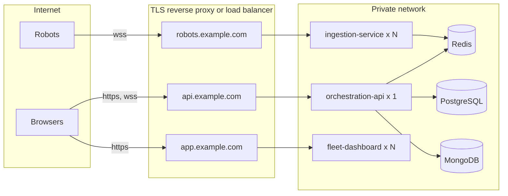

# Deployment

Each service ships a multi stage Dockerfile and the same images run everywhere:

| Target | Wiring | Guide |
| --- | --- | --- |
| Laptop | Docker Compose | [Running and testing](/operations/running) |
| Kubernetes, local or production | Kustomize overlays in `deploy/k8s/` | [Kubernetes](/operations/kubernetes) |
| Any VM over SSH, behind Traefik | Compose override in `deploy/vm/`, `make vm-deploy` | [Any VM with Traefik](/operations/vm) |
| A managed container platform | The platform's own service definitions | [README](https://github.com/cnotv/robot-fleet-platform#hosting-in-the-cloud) |

## Scaling rules

| Service | Replicas | Why |
| --- | --- | --- |
| ingestion-service | Any number | Stateless; each connection is independent |
| fleet-dashboard | Any number | Static and client rendered pages |
| orchestration-api | Exactly one | Every replica subscribes to the channel, so each would write the same samples to MongoDB. Split persistence into a single worker before scaling out |

## Documentation site

This site is built with VitePress from `docs/` and published to GitHub Pages by `.github/workflows/pages.yml` on every push to `main` that touches `docs/`.
