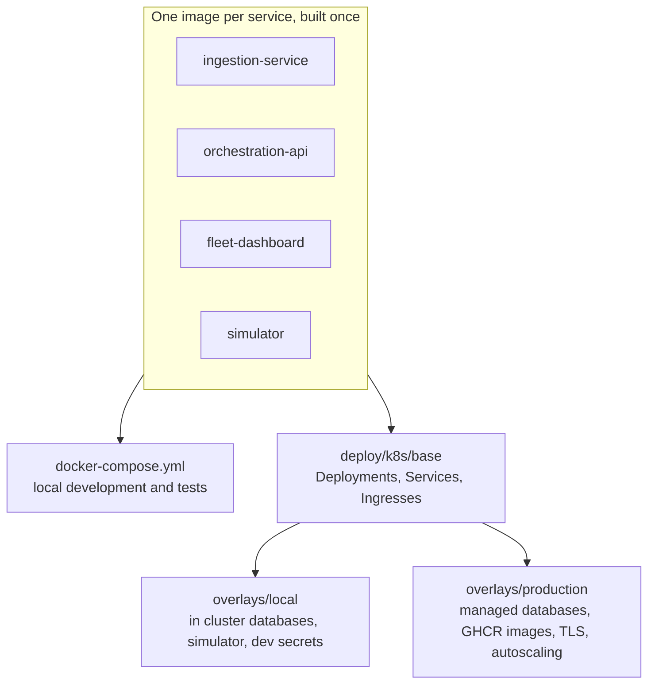

# Kubernetes

The services were separate images from the start; Docker Compose and Kubernetes are two ways to wire the same images. Compose stays the tool for daily development and tests. Kubernetes manifests live in `deploy/k8s/` as a Kustomize base with two overlays.



## Which world for what

| Task | Use |
| --- | --- |
| Write code, run the stack, debug | `make up` (Compose) |
| Unit tests and type checks | `make test` |
| Try the Kubernetes manifests on a laptop | `make k8s-local` |
| Staging and production | `kubectl apply -k deploy/k8s/overlays/production` |

## Layout

| Path | Contents |
| --- | --- |
| `deploy/k8s/base/` | Namespace, one Deployment and Service per service, two Ingresses. No images, secrets or hosts |
| `deploy/k8s/overlays/local/` | Redis, PostgreSQL and MongoDB in the cluster, the simulator, development secrets, locally built images |
| `deploy/k8s/overlays/production/` | GHCR images, hosts and TLS, IP allow list for robots, autoscalers and a disruption budget |

## What the base defines

| Service | Replicas | Probes | Notes |
| --- | --- | --- | --- |
| ingestion-service | 2 | `/healthz` | Stateless; scale freely |
| orchestration-api | 1, `Recreate` | `/healthz` | An init container runs `prisma db push` before each rollout. One replica only: see [Deployment](/operations/deployment#scaling-rules) |
| fleet-dashboard | 2 | `/login` | Reads `PUBLIC_API_URL` at request time, so one image serves every environment |

Every pod runs as a non root user with a read only root filesystem, no privilege escalation, all capabilities dropped and the runtime default seccomp profile. Writable paths are `emptyDir` volumes.

Configuration comes from the `fleet-config` ConfigMap and the `fleet-secrets` Secret:

| Key | In | Used by |
| --- | --- | --- |
| `PUBLIC_API_URL`, `CORS_ORIGIN`, `DEMO_FLEET_FILE` | `fleet-config` | dashboard, api |
| `DATABASE_URL`, `MONGO_URL`, `REDIS_URL`, `JWT_SECRET`, `ADMIN_EMAIL`, `ADMIN_PASSWORD` | `fleet-secrets` | api, ingestion (`REDIS_URL`) |

## Routing

| Ingress | Path | Service |
| --- | --- | --- |
| `fleet-app` | `/api`, `/ws/fleet` | orchestration-api |
| `fleet-app` | `/` | fleet-dashboard |
| `fleet-robots` | `/ws/robot` | ingestion-service |

Dashboard and API share one origin behind `fleet-app`, so the browser needs no CORS and `PUBLIC_API_URL` stays empty. Robots get their own ingress so production can give them a separate host and an IP allow list. Both set a one hour proxy timeout for WebSockets (ingress-nginx annotations; translate them for another controller).

## Local cluster

Works with any cluster whose nodes can see images built by the local Docker daemon: Docker Desktop Kubernetes, OrbStack or minikube with `eval $(minikube docker-env)`. For kind, run `make kind-load` first.

```sh
make k8s-local     # build images, apply the overlay, load the demo fleet, wait for the API
make k8s-forward   # dashboard on http://localhost:3000, API on http://localhost:4000
make k8s-down      # delete the namespace, including database volumes
```

The demo fleet file lives outside `deploy/`, so `make k8s-local` loads it as the `demo-fleet` ConfigMap, which the overlay mounts into the API.

## Production

1. Provision Redis (with Pub/Sub), PostgreSQL and MongoDB, reachable from the cluster.
2. Install ingress-nginx, cert-manager with a `letsencrypt` ClusterIssuer, and metrics-server.
3. Create the secret; it is never stored in the repository:

   ```sh
   kubectl create namespace robot-fleet
   kubectl -n robot-fleet create secret generic fleet-secrets \
     --from-literal=DATABASE_URL=postgresql://... \
     --from-literal=MONGO_URL=mongodb+srv://... \
     --from-literal=REDIS_URL=rediss://... \
     --from-literal=JWT_SECRET=$(openssl rand -hex 32) \
     --from-literal=ADMIN_EMAIL= \
     --from-literal=ADMIN_PASSWORD=...
   ```

   Or sync it from a secret manager with External Secrets Operator.
4. Edit `deploy/k8s/overlays/production/kustomization.yaml`: hosts, the robot allow list and `CORS_ORIGIN`.
5. Pin the images CI pushed for the commit you release, then apply:

   ```sh
   cd deploy/k8s/overlays/production
   kustomize edit set image \
     ingestion-service=ghcr.io/cnotv/robot-fleet-platform/ingestion-service:sha-<commit> \
     orchestration-api=ghcr.io/cnotv/robot-fleet-platform/orchestration-api:sha-<commit> \
     fleet-dashboard=ghcr.io/cnotv/robot-fleet-platform/fleet-dashboard:sha-<commit>
   kubectl apply -k .
   ```

## Images

`.github/workflows/ci.yml` runs every test, renders both overlays and validates them with kubeconform on each pull request. On `main` it pushes `ingestion-service`, `simulator`, `orchestration-api` and `fleet-dashboard` to `ghcr.io/cnotv/robot-fleet-platform/<name>` tagged `sha-<commit>` and `latest`.
