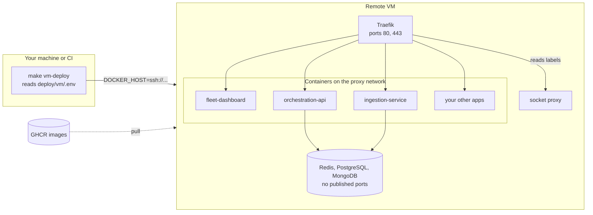

# Any VM with Traefik

Ship the platform from your terminal to one Linux VM on any cloud (Hetzner, DigitalOcean, AWS, Azure, GCP, a home server). Docker talks to the remote host over SSH, so nothing is copied to the server by hand and no deployment tool runs on it.



## Why Traefik

Traefik reads routing from container labels. A service declares its hostname next to its image; Traefik picks it up on start and requests the certificate. There is no proxy UI to fill in per service, and the routing lives in Git with the service.

| File | Purpose |
| --- | --- |
| `deploy/vm/compose.traefik.yaml` | The shared proxy: Traefik, Let's Encrypt, HTTP to HTTPS redirect, a password protected dashboard, shared security headers, a Docker socket proxy |
| `deploy/vm/compose.vm.yaml` | Override for the platform: registry images, Traefik labels, no published ports, memory caps, log rotation |
| `deploy/vm/.env.example` | Every setting, including the target host |
| `Makefile` | `vm-bootstrap`, `vm-proxy`, `vm-deploy`, `vm-status`, `vm-logs`, `vm-down` |

## Requirements

| Resource | Needed | Measured |
| --- | --- | --- |
| CPU | 2 vCPU | under 20% of one core with 200 simulated robots |
| RAM | 4 GB | about 310 MB for Traefik and the whole platform, capped at about 2.3 GB |
| Disk | 20 GB free | images about 1 GB, MongoDB about 1 GB per day of retention with 1,000 robots |
| Architecture | x86 or ARM | CI publishes `linux/amd64` and `linux/arm64` images |

A 4 GB VM leaves about half its memory for other apps.

## First deploy

1. **Create a VM** with Ubuntu or Debian and your SSH key. For example on Hetzner:

   ```sh
   hcloud server create --name fleet --type cx23 --image ubuntu-24.04 --location fsn1 --ssh-key <key>
   ```

2. **Point DNS** at its IP: `fleet.example.com`, `robots.example.com`, `traefik.example.com`.

3. **Configure**:

   ```sh
   cp deploy/vm/.env.example deploy/vm/.env
   ```

   Set `DOCKER_HOST=ssh://root@<ip>`, the three hostnames, `ACME_EMAIL`, and generate the secrets:

   ```sh
   openssl rand -hex 32                     # JWT_SECRET
   openssl rand -hex 24                     # POSTGRES_PASSWORD, hex keeps it URL safe
   htpasswd -nbB admin 'a strong password'  # TRAEFIK_AUTH, keep the single quotes in .env
   ```

4. **Install Docker and swap** on the VM (once):

   ```sh
   make vm-bootstrap
   ```

5. **Start the proxy, then the platform**:

   ```sh
   make vm-proxy
   make vm-deploy
   ```

Open `https://fleet.example.com`. Certificates are issued on the first request to each hostname.

## Updates and releases

| Goal | Command |
| --- | --- |
| Deploy the newest `main` | `make vm-deploy` (pulls `latest`) |
| Pin a release | set `IMAGE_TAG=sha-<commit>` in `deploy/vm/.env`, then `make vm-deploy` |
| Roll back | set the previous `IMAGE_TAG`, then `make vm-deploy` |
| Status, logs | `make vm-status`, `make vm-logs` |
| Stop, keep data | `make vm-down` |

Because it is plain Docker over SSH, the same commands run from a CI job that has the SSH key.

## Adding any other service

Put it on the `proxy` network and give it three labels. No proxy configuration is edited:

```yaml
services:
  whoami:
    image: traefik/whoami
    networks: [proxy]
    labels:
      traefik.enable: "true"
      traefik.http.routers.whoami.rule: Host(`whoami.example.com`)
      traefik.http.routers.whoami.middlewares: security-headers@docker
      traefik.http.services.whoami.loadbalancer.server.port: "80"

networks:
  proxy:
    external: true
```

```sh
DOCKER_HOST=ssh://root@<ip> docker compose up -d
```

Useful middlewares, declared as labels on the service:

| Need | Labels |
| --- | --- |
| Password | `traefik.http.middlewares.<name>.basicauth.users: <htpasswd line>` |
| Restrict by IP | `traefik.http.middlewares.<name>.ipallowlist.sourcerange: 203.0.113.0/24` |
| Redirect a domain | `traefik.http.middlewares.<name>.redirectregex.regex` and `.replacement` |

## Moving from Nginx Proxy Manager

Nginx Proxy Manager stores its routes in its own database, edited through its UI. With Traefik each container carries its route instead.

1. **List what NPM serves**: in its UI, Hosts, Proxy Hosts. Note each domain and the container and port it forwards to.
2. **Label each app** as in the example above, and attach it to the `proxy` network. The target port is the container port, not a published host port.
3. **Recreate NPM features** as middlewares: Access Lists become `basicauth` or `ipallowlist`; Force SSL and HSTS are already on through the redirect and `security-headers@docker`; Streams (raw TCP or UDP) need an extra Traefik entry point.
4. **Switch over**, a few seconds of downtime:

   ```sh
   docker stop <npm container>     # frees ports 80 and 443
   make vm-proxy                    # Traefik takes them over
   docker compose up -d             # in each app folder, to apply the labels
   ```

5. **Check** every route on the Traefik dashboard at `https://traefik.example.com`.
6. **Roll back** if needed: `docker compose -p proxy down`, then `docker start <npm container>`.
7. **Remove NPM** and its volumes once you are satisfied.

## Security defaults

* Databases publish no ports; only Traefik listens on 80 and 443.
* Traefik reaches Docker through a socket proxy that only allows reading containers, networks, services and tasks, on an internal network.
* The robot endpoint only accepts `ROBOTS_ALLOWLIST`, by default nobody outside the VM. The simulator connects inside the Docker network and is not affected.
* The Traefik dashboard requires the `TRAEFIK_AUTH` password.
* Access logs are off, because the dashboard socket carries its JWT in the query string.
* Traefik's 60 second read timeout is disabled so robot and dashboard WebSockets stay open; a 75 second socket was checked through the proxy.

## Changing telemetry retention later

`TELEMETRY_RETENTION_DAYS` (default 2 on a VM) is applied when MongoDB first creates the collection. To change it on a running system:

```sh
DOCKER_HOST=ssh://root@<ip> docker compose -p robot-fleet-platform exec mongodb mongosh fleet --eval \
  'db.runCommand({ collMod: "telemetrysamples", index: { keyPattern: { ingestedAt: 1 }, expireAfterSeconds: 3 * 86400 } })'
```
