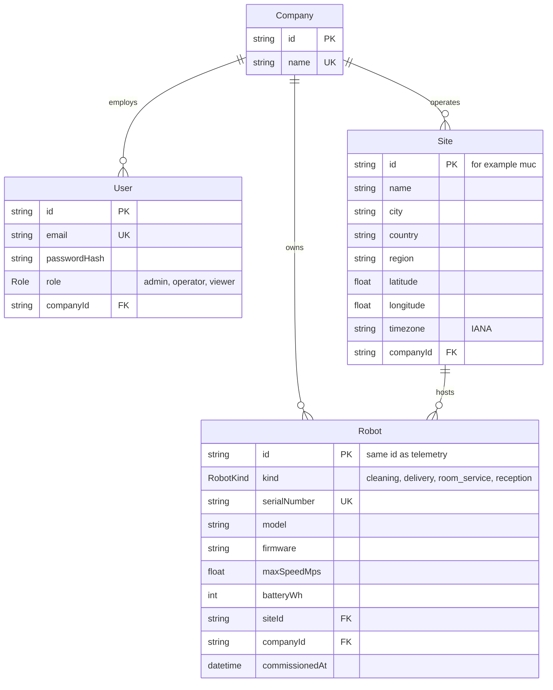

# Data model

## PostgreSQL

Schema: `orchestration-api/prisma/schema.prisma`.

## MongoDB

| Collection | Contents | Indexes | Retention |
| --- | --- | --- | --- |
| `telemetrysamples` | Persisted samples with `event`: `task_started`, `status_changed` or `heartbeat` | `robotId + timestamp`, `ingestedAt` | 7 days (TTL) |
| `errorlogs` | Mapping failures, HTTP errors, failed writes | none | Unbounded |
| `skills` | Skill Store catalogue: slug, version, compatible models, entrypoint, config schema | `slug` unique | Unbounded |

## Redis

Redis holds nothing that cannot be rebuilt: `fleet:live_state` refills within one second of robots reporting.
